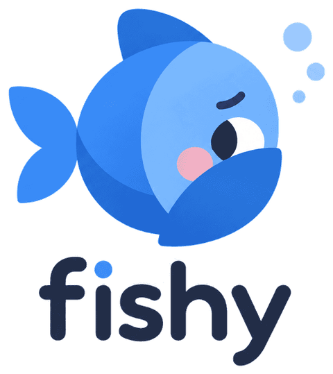

<p align="center">
  <picture>
    <source media="(prefers-color-scheme: dark)" srcset="assets/readme-logo-dark.png">
    
  </picture>
</p>
<p align="center">Checks whether the email you're reading in Gmail looks like phishing or a scam.</p>

> [!WARNING]
> Fishy is an experiment. Its verdicts come from an AI model (TypeSafe's Jev) that can misjudge an email in either direction: it can flag a legitimate email as suspicious, and it can miss a real phishing attempt, including one deliberately crafted to fool classifiers like it. Use your own judgement on every email. Never treat a "Looks fine" result as permission to enter credentials, click a link, or send money. Fishy is a second opinion, not a guarantee.

## What it does

Fishy is a browser extension (Manifest V3) that runs in Chrome, Firefox, and Safari. It reads the email you currently have open in Gmail, sends its contents to TypeSafe's Jev model, and shows you a verdict with the reasoning behind it. There's no sign-up, no Fishy backend, and no account: you bring your own TypeSafe API key, and the request goes straight from your browser to TypeSafe. Everything runs on demand: nothing is scanned automatically, and nothing is stored except your key and settings.

Each check runs eight independent yes/no assessments, plus one overall score:

- **Asks for passwords, codes, or account details**: flags emails that ask you to enter, confirm, or verify a password, login, or one-time code.
- **Asks for money or payment details**: flags emails that ask you to send money, wire funds, buy gift cards, or share card or bank details.
- **Creates urgency or threatens consequences**: flags emails that pressure you to act immediately or threaten something like account closure or legal action.
- **Promises an unexpected prize, refund, or payment**: flags emails claiming you've won or are owed an unexpected prize, refund, inheritance, or payment.
- **Sender name doesn't match the sending domain**: flags emails where the claimed sender doesn't match the domain the email actually came from.
- **Links go somewhere other than they claim**: flags emails whose links point somewhere different from what they display or claim.
- **Replies are redirected to a different address**: flags emails where replies would go to a different, unrelated address than the sender.
- **Impersonates a known company or person**: flags emails posing as a known company, bank, or person in a way that doesn't fit who actually sent it.

Alongside those eight, Jev produces one overall **scam score** from 0–100%, which is the main driver of the verdict:

- **Looks fine**: the scam score is under 30% and none of the eight signals is especially strong.
- **Suspicious**: the scam score is 30% or higher, or any single signal is 60% or higher. Read carefully before acting.
- **Likely phishing**: the scam score is 60% or higher, or one of the four highest-stakes signals (asks for credentials, asks for payment, sender identity mismatch, or link domain mismatch) is 85% or higher on its own. Don't click links or reply.

## Setup

Fishy isn't published on any extension store, so you build it from source and load it into your browser.

**Prerequisites:**

- [Node.js](https://nodejs.org) 20 or later, and npm (comes with Node)
- A [TypeSafe](https://typesafe.ai) account and API key
- Per browser:
  - Chrome or any Chromium-based browser (Edge, Brave, Arc, etc.)
  - Firefox 121 or later
  - Safari 16.4 or later on macOS; requires Xcode

**Build**

```
git clone https://github.com/lucas-avila/fishy.git
cd fishy
npm install
npm run build
```

This produces `dist/chrome`, `dist/firefox`, and `dist/safari`. To build a single target, use `npm run build:chrome`, `npm run build:firefox`, or `npm run build:safari`.

**Install in Chrome (or Edge, Brave, Arc)**

1. Open `chrome://extensions`.
2. Turn on **Developer mode** (top right corner).
3. Click **Load unpacked** and select the `dist/chrome` folder.
4. Fishy's fish icon should now appear in your toolbar. If you don't see it, click the puzzle-piece icon in Chrome's toolbar and pin Fishy so it stays visible.

**Install in Firefox**

For a quick test, use:

```
npm run firefox:run
```

This opens a fresh Firefox profile with Fishy already loaded.

To load manually, open `about:debugging#/runtime/this-firefox`, click **Load Temporary Add-on**, and pick `dist/firefox/manifest.json`. Temporary add-ons are removed when Firefox closes. For a permanent install, run:

```
npm run firefox:package
```

This creates an unsigned package in `dist/firefox-artifacts/` (via `web-ext build`). Submit it to addons.mozilla.org for signing, or install it directly in Firefox Developer Edition or Nightly with `xpinstall.signatures.required` set to false in about:config. After installing permanently, Firefox shows a permission grant prompt for mail.google.com and api.typesafe.ai (Firefox 127+), and permissions can be changed under about:addons > Fishy > Permissions.

**Install in Safari**

```
npm run build:safari
npm run safari:convert
```

This creates an Xcode project in `build/safari/`. For personal use: enable the Develop menu in Safari's settings, turn on "Allow unsigned extensions" in the Security tab, open the generated Xcode app in Xcode, build and run it once, then enable Fishy in Safari > Settings > Extensions and allow it on mail.google.com when prompted. Distribution beyond your own Mac requires an Apple Developer account.

**Add your API key**

The first time you install Fishy with no key saved, its options page opens automatically. If it doesn't (or you closed it), right-click the Fishy icon and choose **Options**, or open the popup and click the gear icon. Paste your TypeSafe API key and click **Save**.

**If Fishy asks for permission**

If the browser did not grant access to api.typesafe.ai and mail.google.com (this happens in Firefox when you decline at install), the options page shows a "Permission needed" banner at the top with a **Grant access** button; click it and accept the prompt. The popup's error also offers an **Open options** link in that case.

**Use it**

1. Go to [mail.google.com](https://mail.google.com) and open an email.
2. Click the Fishy icon in your toolbar.
3. Click **Check this email**.

Fishy reads the open message, sends it to TypeSafe, and shows a result card: the verdict, the overall scam score as a percentage, and a bar for each of the eight signals above so you can see exactly what tripped it. If you installed or updated the extension while a Gmail tab was already open, reload that tab once before checking.

**Turning assessments off:** in Options, each of the eight assessments has its own switch. Turning one off means it's left out of the request sent to TypeSafe entirely and never counts toward the verdict. The overall scam score always runs regardless of which signals are enabled.

**Updating:** pull the latest code and rebuild:

```
git pull
npm run build
```

Then reload the extension: in Chrome, click the reload icon on Fishy's card in chrome://extensions. In Firefox, click the reload button in about:debugging, or rerun `npm run firefox:run`. In Safari, rebuild and run the Xcode app again.

## Privacy

When you click **Check this email**, Fishy sends the following to `api.typesafe.ai`, and nowhere else:

- Sender name and address
- Reply-to address, if present
- Subject line
- Body text
- Links found in the email
- Your API key, in the request header

There's no Fishy server in between, and no analytics of any kind. Your API key and your settings (which assessments are enabled) are stored only in this browser's local extension storage. They aren't synced anywhere by Fishy.

Because the key lives in that local storage and is sent on every check, treat it like any other credential: use a key dedicated to Fishy rather than reusing one from another app, and rotate it in your TypeSafe account if you ever suspect it's leaked.

## How it works

A content script (`src/content.ts`, `src/extract`) reads the DOM of the Gmail tab and pulls out the open message: sender, reply-to, subject, body text, and links. The background service worker (`src/background.ts`) sends that, along with the eight yes/no questions and the overall Score question, in a single request to TypeSafe's System One endpoint. `src/analyze` turns the returned probabilities into the verdict shown above, and the popup (`src/popup`) renders the result. The extension is a Manifest V3 browser extension. See [docs.typesafe.ai](https://docs.typesafe.ai) for how TypeSafe's questions and scoring work.

## Development

| Script | What it does |
| --- | --- |
| `npm run dev` | Starts Vite in watch mode for Chrome development. |
| `npm run dev:firefox` | Starts Vite in watch mode for Firefox development. |
| `npm run build` | Builds the extension for Chrome, Firefox, and Safari into `dist/`. |
| `npm run build:chrome` | Builds for Chrome only. |
| `npm run build:firefox` | Builds for Firefox only. |
| `npm run build:safari` | Builds for Safari only. |
| `npm run firefox:run` | Launches Firefox with the extension via web-ext. |
| `npm run firefox:lint` | Runs web-ext lint on the Firefox build. |
| `npm run firefox:package` | Creates an .xpi package for Firefox in `dist/firefox-artifacts/`. |
| `npm run safari:convert` | Runs Apple's converter to create an Xcode project in `build/safari/`. |
| `npm run test` | Runs the Vitest suite. |
| `npm run typecheck` | Runs `tsc --noEmit`. |

Project layout:

- `manifest/`: per-browser manifest overrides and the merge function.
- `src/extract`: pulls an `ExtractedEmail` out of the Gmail DOM.
- `src/analyze`: builds the TypeSafe request, defines the eight assessments, and turns the response into a verdict.
- `src/popup`: the toolbar popup UI.
- `src/options`: the options page (API key, per-assessment toggles).
- `src/background.ts`: the service worker that talks to TypeSafe.
- `src/content.ts`: the Gmail content script.
- `src/shared`: types shared across the above.

## Limitations

- Gmail web only (`mail.google.com`); there's no support for other webmail clients, the Gmail mobile app, or desktop mail clients.
- Manual, one email at a time: each click of "Check this email" is a single API call, there's no automatic scanning of your inbox.
- Extraction depends on Gmail's current DOM structure, which Google can change without notice and break.
- The verdict thresholds (`src/analyze/verdict.ts`) are untuned defaults, not the result of any evaluation against real phishing samples.
- Firefox and Safari support is new and less tested than Chrome.

## License

MIT, see [LICENSE](LICENSE). The bundled Quicksand font is licensed under the SIL Open Font License 1.1 (`public/fonts/OFL.txt`).
